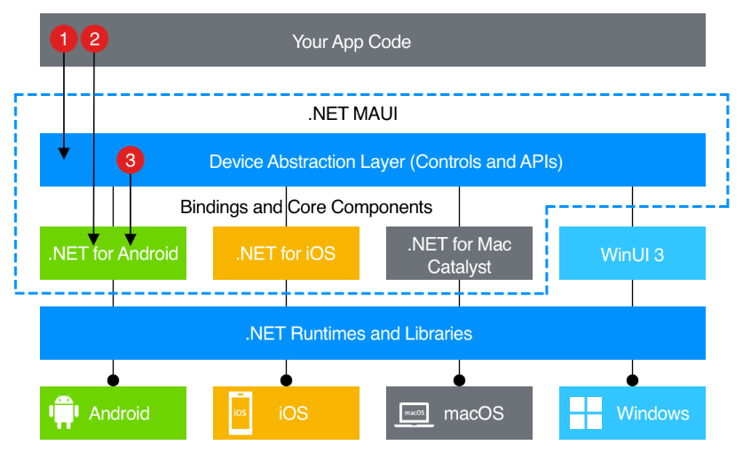

.NET 8 MAUI Study
===

## MAUI って何だっけ?



> https://learn.microsoft.com/ja-jp/dotnet/maui/what-is-maui?view=net-maui-8.0 より

- 覚えてる? .NET Core っていう呼び方はもう古くて、 .NET っていう名前だよ。
- マルチプラットフォームフレームワークだよ。 Windows, macOS, iOS, Android 用にビルドできるらしいよ。
- Multi-platform App UI の略だよ。
- これ、今回の study の一番の印象なんだけれど、まだゼンゼン未完成のフレームワークかな……
    - msi とか exe のビルドがしづらい (下にやり方書くけど)
    - VscDotnetCore8Study みたいに Visual Studio Code で楽しく作ることは不可能で VS 2022 が必要
        - [https://github.com/yuu-eguci/VscDotnetCore8Study](https://github.com/yuu-eguci/VscDotnetCore8Study)

## 実装どんな感じだっけ?

- Vue.js でたとえるとぼくには分かりやすい↓
- Page は Pages フォルダに追加する
    - Pages フォルダ右クリック > Add > New Item > .NET MAUI ContentPage (XAML)
    - Vue で言うところの template が xaml ファイル
    - Vue で言うところの script が xaml.cs ファイル
- Control は Controls フォルダに追加する
    - Controls フォルダ右クリック > Add > New Item > .NET MAUI ContentView (XAML)
    - Vue で言うところの components ね
- 中身は GPT ちゃんに聞けばいいよ
- ルーティング (ページを登録すること) は AppShell で行う
    - AppShell.xaml にルートページ (スタックのトップ) を登録する
    - AppShell.xaml.cs にルートに積むページを登録する
    - これややこしすぎない? 同じファイルにしとけよ
- ナビゲーションは `GoToAsync` とかで行う
    - ルートページ -> ルートページは `Shell.Current.GoToAsync($"///{nameof(RootPage)}")`
    - スタックを積むときは `Shell.Current.GoToAsync(nameof(NormalPage))`
    - スタックを戻るときは `Shell.Current.Navigation.PopAsync()`
    - スタックをリセットしてルートページへ飛ぶときは `Shell.Current.GoToAsync($"//{nameof(LoginPage)}")`

## ビルドどうやるんだっけ?

- 初期状態では、ストアアプリを作る設定になっている
- 面倒くせーよ exe とか使いたいに決まってんだろ
- csproj をこうする↓

```xml
<Project Sdk="Microsoft.NET.Sdk">

    <PropertyGroup>
        <TargetFrameworks>net8.0-android;net8.0-ios;net8.0-maccatalyst</TargetFrameworks>

        <WindowsPackageType>None</WindowsPackageType> <-- これを追加
```

- launchSettings.json をこうする↓

```json
{
  "profiles": {
    "Windows Machine": {
      "commandName": "Project", <-- Project にする
      "nativeDebugging": false
    }
  }
}
```

- Visual Studio 2022 でターミナルを開いてこれ↓

```bash
dotnet publish Dotnet8MAUIStudy.sln -f net8.0-windows10.0.19041.0 -c Release -p:RuntimeIdentifierOverride=win10-x64 -p:WindowsPackageType=None -p:WindowsAppSDKSelfContained=true -p:PublishSingleFile=true
```
